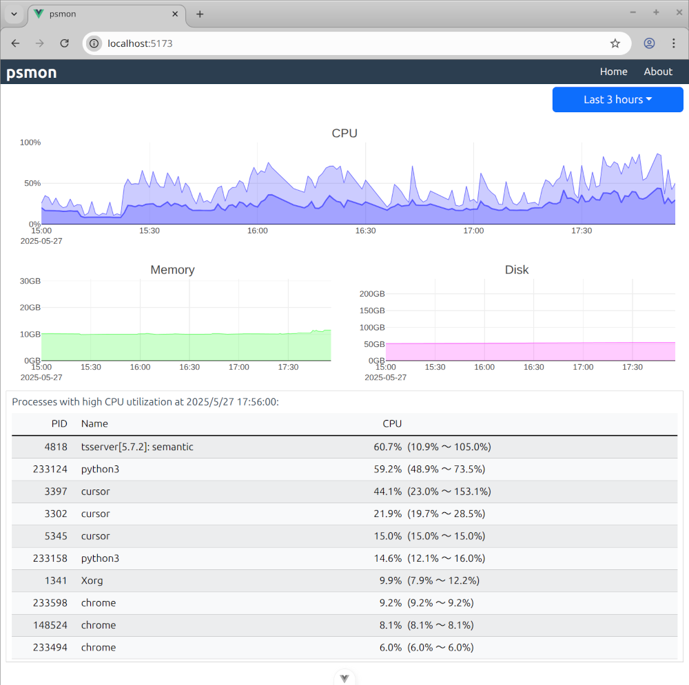

# psmon - Process and System Monitor

`psmon` is a tool example for monitoring system resources. It is written in [Vue.js](https://vuejs.org/) and [Plotly.js](https://plotly.com/javascript/).

<p align="center">
  
</p>

## How to launch psmon

```bash
git clone https://github.com/yamakox/psmon.git
cd psmon/
cp .env.example .env   # please change the environment variables
docker compose build --no-cache
docker compose up -d
```

Please browse `http://{HOST}:{PORT}/` (default: `http://127.0.0.1:8000/`) from your Web browser.

## Environment variables

You can change `.env` file to configure your environment. For more information about InfluxDB v2, please see the [quick reference](https://hub.docker.com/_/influxdb).

| name                      | value                                                                    |
| ------------------------- | ------------------------------------------------------------------------ |
| HOST                      | A host name or IP address to connect this app                            |
| PORT                      | A port number to connect this app                                        |
| DEBUG_PORT                | A port number for the connection from debugpy                            |
| VITE_PORT                 | A port number of Vite server"                                            |
| ROOTFS_PATH               | A directory of Docker container to mount the host's root directory (`/`) |
| TOP_PROCESS_COUNT         | A number of processes for recording and reporting                        |
| INFLUXDB_PORT             | A port number to publish InfluxDB's port                                 |
| INFLUXDB_INIT_MODE        | InfluxDB's mode: `setup` or `upgrade`                                    |
| INFLUXDB_INIT_USERNAME    | A name for your initial admin user⁠                                      |
| INFLUXDB_INIT_PASSWORD    | A password for your initial admin user                                   |
| INFLUXDB_INIT_ORG         | A name for your initial organization                                     |
| INFLUXDB_INIT_BUCKET      | A name for your initial bucket⁠                                          |
| INFLUXDB_INIT_RETENTION   | A duration⁠ to use as the initial bucket's retention period⁠             |
| INFLUXDB_INIT_ADMIN_TOKEN | A string value to set for the Operator token⁠                            |
